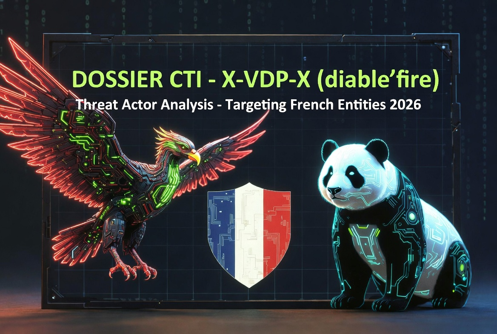

# 🧠 CTI Dossier: X-VDP-X (diable'fire) — Threat Actor Targeting French Entities via CMS Exploitation


<p align="center">
  
</p>



**Author:** El Cóndor (@Panda_Sec_Intel)  
**Date:** July 23, 2026  
**Status:** Active Analysis / Open Source Intelligence (OSINT)  
**License:** Free for defensive and research purposes

---

## 📌 Disclaimer

> **This dossier is based exclusively on Open Source Intelligence (OSINT), public social media posts, and threat intelligence platforms.**
> It is intended for the global cybersecurity community to understand the TTPs, improve defensive postures, and conduct proactive threat hunting.
> The legal analysis provided is a contextual interpretation of public French law for educational purposes and does not constitute legal advice. All attributions are based on self-proclaimed claims by the threat actor.

---

## 📋 Executive Summary

This report documents and analyzes the threat actor identified as **X-VDP-X** (alias **diable'fire**), responsible for the recent breach against **France Cyber Défense** (francecyberdefense.fr), a French cybersecurity services provider, on July 23, 2026.

X-VDP-X is an **individual or small collective** with a medium-low profile, operational primarily since mid-2026, with a self-declared base in **Paris, France**. Their modus operandi is characterized by exploiting common CMS vulnerabilities (WordPress/Joomla), **defacements**, and database exfiltration for **notoriety and potential monetization** in underground forums.

**Not attributed to any nation-state** (China, Russia, Iran, etc.) nor does it exhibit the sophistication level typical of APTs. Their activity, while noisy and visible, represents a **medium-low risk** for well-protected critical infrastructures, but **high risk for SMEs, universities, and websites running outdated CMS**.

---

## 2. ACTOR PROFILE

### 2.1 Identity and Aliases

| Field | Value |
|-------|-------|
| **Primary Alias** | X-VDP-X |
| **Secondary Alias** | diable'fire (also written "diable fire" or "diablefire") TELEGRAM ID / 6321438384 |
| **Active Platforms** | Telegram and Twitter, group name: Team X_VDP_X: (@xvdpx6). Group telegram Id 3280873247 |
| **Self-declared Location** | Paris, France |
| **Estimated Profile** | Individual or small collective (2-3 persons) |
| **Technical Level** | Medium-low (advanced script-kiddie / defacer) |

```
This is diable'fire 
Messaց℮ diversity 100.00% 
From 2/6/2025 to 4/24/2025 
4 messages in 2 groups 
100.00% replies 0.00% average 
Circles: 0, voice: 0 
Favorite group: 
 
ID: 6321438384 
ᴜsernames:
|
----------------------------------------------------
Most used words on Telegram, diable'ƒire (@diablefire) often uses this words: 
├3 - 3 informations
├2 - 3 free
├1 - 2 datasec, merci

[Settings. Chanցe - /words 6321438384 1000 3] 
Messages: 4 
1. Exclude: 0 trivial words 
2. Words to print: 3
 
-------------------------------------
 
This is channel : X-VDP-X 
 
ID: 3280873247 
 
Owner : ❔ 
 
Owner (history): ❔ 
 
About: 
--- --- --- --- --- --- --- 
Team X-VDP-X 
--- --- --- --- --- --- ---
-------------------------------------
```

### 2.2 Operational Style

The actor follows a consistent pattern across all operations:

1. **Reconnaissance** of CMS vulnerabilities (WordPress, Joomla) — outdated plugins, weak configurations, default credentials.
2. **Compromise** through configuration/admin mistakes or web server intrusions.
3. **Defacement** of the main page, replacing it with the message "HACKED BY X-VDP-X".
4. **Exfiltration** of complete databases, configuration files (`wp-config.php`), credentials, and logs.
5. **Publication** of proof (screenshots, partial dumps) on social networks.
6. **Offer for sale** of data on underground forums or Telegram.

### 2.3 Motivation

The primary motivation appears to be **notoriety** and **recognition** within the defacer community, as evidenced by their recurring motto: *"I just want to be the best defacer"*. Secondarily, there is an **economic** aspect through the sale of access and exfiltrated databases. No clear political or religious ideology has been identified.

---

## 3. CLAIMED VICTIMS (CHRONOLOGY)

X-VDP-X has claimed a significant number of attacks, with a **predominant focus on France** and some international victims. The following table compiles confirmed victims:

| Date | Victim | Domain | Type | Country | Proof of Concept |
|------|--------|--------|------|---------|------------------|
| **23/07/2026** | **France Cyber Défense** | francecyberdefense.fr | Defacement + Data Breach | FR | Config/admin mistake |
| **23/07/2026** | Université d'Avignon | univ-avignon.fr | Data Breach (41 subdomains, 12,496 accounts) | FR | — |
| **21/06/2026** | Caïmans 72 | caimans72.fr | Defacement | FR | Config/admin mistake |
| **21/06/2026** | brain.lazyy.fr | brain.lazyy.fr | Defacement | FR | Config/admin mistake |
| **21/06/2026** | auth.urbanflow.lazyy.fr | auth.urbanflow.lazyy.fr | Defacement | FR | Config/admin mistake |
| **21/06/2026** | hoppscotch.lazyy.fr | hoppscotch.lazyy.fr | Defacement | FR | Config/admin mistake |
| **21/06/2026** | sonarqube.lazyy.fr | sonarqube.lazyy.fr | Defacement | FR | Config/admin mistake |
| **21/06/2026** | affine.lazyy.fr | affine.lazyy.fr | Defacement | FR | Config/admin mistake |
| **21/06/2026** | web.choaristudio.com | web.choaristudio.com | Defacement | FR | Config/admin mistake |
| **21/06/2026** | www.point-core.com | www.point-core.com | Defacement | FR | Config/admin mistake |
| **21/06/2026** | www.b742.com | www.b742.com | Defacement | FR | Config/admin mistake |
| **21/06/2026** | test2025.samclap-ufolep.fr | test2025.samclap-ufolep.fr | Defacement | FR | Config/admin mistake |
| **19/06/2026** | Université Paris 13 | urit.univ-paris13.fr | Defacement | FR | — |
| **04/07/2026** | Tech Yukon | — | Defacement | — | — |
| **04/07/2026** | Twin Towing | — | Defacement | — | — |
| **04/07/2026** | D2P Graphics | — | Defacement | — | — |
| **10/02/2026** | Water Research and Innovation Platform (WSIP) | thewsip.mwi.gov.jo | Data Breach (data sale) | Jordan | — |
| **03/06/2026** | newfarmliving.com | newfarmliving.com | Defacement | — | — |

### 3.1 Victim Pattern Analysis

- **Geographic Concentration:** >70% of victims are in France, suggesting the actor operates from French territory or has privileged knowledge of the French digital ecosystem.
- **Affected Sectors:** Universities, technology companies, government sites (Jordan), sports clubs, design studios.
- **Common Vector:** All compromised sites use **vulnerable CMS** (WordPress, Joomla) with **deficient administrative configurations**.

---

## 4. TECHNICAL ANALYSIS OF THE FRANCE CYBER DÉFENSE BREACH

### 4.1 Incident Summary

On July 23, 2026, the France Cyber Défense website (francecyberdefense.fr) was compromised by X-VDP-X. The homepage was replaced with a message declaring: **"HACKED BY X-VDP-X"**, with attribution to diable'fire.

The actor claims to have **infiltrated the network** and **exfiltrated sensitive data**. Although these claims require independent verification, published evidence (screenshots, file listings) suggests compromise **beyond mere defacement**.

### 4.2 Compromised Services and Components

The compromised site ran **WordPress** with multiple extensions and components:

| Component | Function | Associated Risk |
|-----------|----------|-----------------|
| **WordPress** | Main CMS | Configuration and user exposure |
| **WooCommerce** | E-commerce platform | Customer data, orders, sessions |
| **Simply Schedule Appointments (SSA)** | Appointment management | Rendezvous/client information |
| **Slider Revolution** | Presentation plugin | Known vulnerabilities |
| **Rank Math SEO** | SEO plugin | Metadata and configuration |
| **Action Scheduler** | Scheduled task management | Logs and internal processes |

### 4.3 Exfiltrated Files (According to Claim)

The actor published a list of extracted files including:

| File | Potential Content | Sensitivity Level |
|------|-------------------|-------------------|
| `wp-config.php` | WordPress configuration, database credentials | **CRITICAL** |
| `users.txt` | WordPress user list | HIGH |
| `usermeta.txt` | User metadata | HIGH |
| `server_info.txt` | Server information | MEDIUM |
| `options_apikeys.txt` | API keys | **CRITICAL** |
| `s3_credentials.txt` | S3 storage credentials | **CRITICAL** |
| `woocommerce-sessions.txt` | Customer sessions | HIGH |
| `wp_woocommerce_log.txt` | WooCommerce logs | MEDIUM |
| `wp_wc_orders_meta.txt` | Order metadata | HIGH |
| `ssa-appointments.txt` | Scheduled appointments | HIGH |

The presence of `s3_credentials.txt` and `options_apikeys.txt` is **particularly concerning**, suggesting the actor may have gained access to **cloud infrastructure** and **third-party services**.

### 4.4 Techniques, Tactics, and Procedures (TTPs)

Based on the analysis of X-VDP-X attacks, the following TTPs are identified according to the MITRE ATT&CK framework:

| Tactic | Technique | MITRE Code | Evidence |
|--------|-----------|------------|----------|
| **Reconnaissance** | Vulnerability Scanning | T1595 | Pattern of targeting vulnerable CMS |
| **Initial Access** | Exploit Public-Facing Application | T1190 | WordPress/Joomla vulnerabilities |
| **Initial Access** | Default Credentials | T1078 | "Configuration/admin mistake" |
| **Persistence** | Create Account | T1136 | Access to admin panels |
| **Exfiltration** | Exfiltration over C2 Channel | T1041 | Publication of dumps on networks |
| **Impact** | Defacement | T1491 | "HACKED BY X-VDP-X" |
| **Impact** | Data Destruction (partial) | T1485 | Content alteration |

**Sophistication Level:** **LOW-MEDIUM**. No advanced techniques are observed such as:
- Zero-days
- Custom malware
- Advanced evasion techniques
- Complex lateral movement
- Ransomware

---

## 5. INDICATORS OF COMPROMISE (IOCs)

### 5.1 Identified IP Addresses

| IP | Location | Association |
|----|----------|-------------|
| `46.235.180.85` | France | Nginx server (lazyy.fr) |
| `92.222.139.190` | France | Apache server |
| `81.194.43.208` | France | Apache server (Université Paris 13) |
| `185.125.27.212` | Switzerland | Apache server (lespartisans.ch) |
| `185.49.20.100` | France | Apache server |
| `185.221.182.212` | France | LiteSpeed server (caimans72.fr) |

### 5.2 Associated Domains and URLs

- **X/Twitter Profile:** `@xvdpx6` (or variations `@6xvdpx`)
- **Telegram Channel:** `@diablefire`
- **Defacement URLs:**
  - `https://2025.lespartisans.ch/media/com_pagebuilderck/gfonts/hacked.html`
  - `https://urit.univ-paris13.fr/Hackedbyxvdpx.txt`

### 5.3 Defacement Patterns

- **Characteristic Message:** "HACKED BY X-VDP-X"
- **Signature:** "diable'fire — Team: X-VDP-X"
- **Motto:** "I just want to be the best defacer"

---

## 6. THREAT ASSESSMENT

### 6.1 Risk Matrix

| Dimension | Assessment | Justification |
|-----------|------------|---------------|
| **Technical capability** | Low-Medium | Exploits known vulnerabilities, no advanced malware |
| **Impact capability** | Medium | Can exfiltrate sensitive data and cause reputational damage |
| **Malicious intent** | Medium | Seeks notoriety and economic benefit |
| **Persistence** | Medium | Active since February 2026, with peaks in June-July |
| **Geographic scope** | Medium | Focus on France, with international incursions |
| **Risk to critical infrastructures** | Low | Does not attack OIV (Operators of Vital Importance) |
| **Risk to SMEs/universities** | **High** | Primary targets of the actor |

### 6.2 Threat Classification

X-VDP-X is classified as a **medium-low level opportunistic actor**, comparable to:

- **Defacers** from the European underground scene
- **Advanced script-kiddies** with CMS knowledge
- **Hacktivists** without defined ideology

**Not comparable to:**
- State APTs (Mustang Panda, APT28, etc.)
- Sophisticated ransomware groups (LockBit, BlackCat)
- Pro-Russian hacktivists (NoName057(16), Killnet)

### 6.3 Potential Impact of the France Cyber Défense Breach

1. **Reputational:** A compromised cybersecurity company generates significant **loss of trust** among its clients.
2. **Supply chain:** Exfiltrated credentials and API keys could be used for **attacks against France Cyber Défense clients**.
3. **Regulatory:** Potential sanctions under **GDPR** if personal data exposure is confirmed.
4. **Operational:** Service interruption and need for **exhaustive forensic audit**.

---

## 7. STRATEGIC RECOMMENDATIONS

### 7.1 For ANSSI / CERT-FR

1. **Formal notification:** Ensure France Cyber Défense has notified the incident to ANSSI according to current regulations.
2. **Active monitoring:** Monitor accounts `@xvdpx6` and `@diablefire` to identify new victims or data publications.
3. **International coordination:** Contact CERT-JO (Jordan) regarding the incident against the government water platform.
4. **Forensic analysis:** Request France Cyber Défense access logs to identify the exact entry vector.

### 7.2 For France Cyber Défense

1. **Immediate containment:**
   - Isolate the compromised server.
   - Rotate **all** credentials and API keys (especially S3 keys).
   - Revoke active WordPress/WooCommerce sessions.

2. **Forensic investigation:**
   - Analyze access logs to determine the entry vector.
   - Identify which data was actually exfiltrated (not just claimed).
   - Verify the integrity of `wp-config.php` and other configuration files.

3. **Communication:**
   - Notify affected clients (transparency).
   - Coordinate with ANSSI for public communication.

4. **Security reinforcement:**
   - Implement **WAF** (Web Application Firewall).
   - Activate **MFA** (Multi-Factor Authentication) for all administrative accesses.
   - Update **all** plugins and the WordPress core.
   - Conduct a **complete security audit** of the code and infrastructure.

### 7.3 For other French organizations

1. **CMS Audit:** Verify that all WordPress/Joomla sites are updated.
2. **Configuration review:** Remove default credentials and exposed configuration files.
3. **Monitoring:** Check logs for accesses from identified IPs (`46.235.180.85`, `92.222.139.190`, etc.).
4. **Training:** Raise staff awareness about risks of weak administrative configurations.

---

## 8. TREND ANALYSIS AND PROJECTIONS

### 8.1 Activity Evolution

X-VDP-X shows a **pattern of increasing activity**:

- **February 2026:** First documented attack (WSIP, Jordan)
- **June 2026:** Activity peak (>15 defacements in one week)
- **July 2026:** Escalation to **data breaches** with complete database exfiltration

This trajectory suggests the actor is **gaining confidence and capabilities**. They are likely to continue targeting medium-profile French objectives, with possible escalation to:

- **Educational institutions** (already attacked: Université d'Avignon, Université Paris 13)
- **Technology SMEs**
- **Local government sites**

### 8.2 Monetization Potential

The actor has demonstrated willingness to **sell data** in underground forums. It is likely they will:

1. Attempt to monetize France Cyber Défense data on **BreachForums** or Telegram channels.
2. Offer **persistent accesses** to compromised systems to other actors.
3. Escalate to **extortion** if particularly sensitive data is found.

---

## 9. SOURCES AND REFERENCES

| Source | Link | Type |
|--------|------|------|
| DefacerID — Cyber Attack Reports | https://www.defacer.id | Defacement registry |
| FrenchBreaches — France Cyber Défense | https://frenchbreaches.com/alertes/france-cyber-d-fense-mrxd8ygo8ndtxqd9jt3 | Breach analysis |
| FrenchBreaches — Université d'Avignon | https://frenchbreaches.com/alertes/universit-d-avignon-mrxhevofqu9spqmlhu | Breach analysis |
| Brinztech — WSIP Breach | https://www.brinztech.com/breach-alerts/ | Data sale alert |
| OSINTxLab | https://www.osintxlab.com | Threat aggregator |
| ANSSI | https://cyber.gouv.fr | National security agency |
| **This dossier (GitHub)** | **https://github.com/Condor2026/cti-xv-dpx** | **Official repository** |

---

## 10. APPENDIX — GLOSSARY OF TERMS

| Term | Definition |
|------|------------|
| **Defacement** | Unauthorized alteration of a website's visual content |
| **Data Breach** | Unauthorized exfiltration of sensitive data |
| **CMS** | Content Management System |
| **APT** | Advanced Persistent Threat |
| **WAF** | Web Application Firewall |
| **MFA** | Multi-Factor Authentication |
| **OIV** | Opérateur d'Importance Vitale (Operator of Vital Importance) |
| **IOC** | Indicator of Compromise |

---

## LEGAL ANNEX — COMPLEMENTARY REPORT

**Potential Offenses Committed by X-VDP-X (diable'fire) under the French Penal Code**

**Date:** July 23, 2026

---

### 1. INTRODUCTION AND LEGAL FRAMEWORK

The French legal framework for combating cyberattacks is structured around **articles 323-1 to 323-8 of the Penal Code** (Code pénal), resulting from the **Godfrain Law No. 88-19 of January 5, 1988**, subsequently reinforced by successive reforms — notably the **LOPPSI 2 Law of March 14, 2011** and the laws of 2014 and 2015 that expanded incriminations and increased penalties.

The concept of *automated data processing system* (STAD) is not explicitly defined by law, which is a deliberate choice by the legislator to ensure the adaptability of the text to technological evolution. Jurisprudence maintains a **broad conception** encompassing any organized set of materials and software intended for information processing: a server, a corporate network, a website, a messaging system, a connected object, or a smartphone.

The five fundamental offenses covering all **attacks against information systems** are:
1. Fraudulent access (art. 323-1)
2. Impeding system function (art. 323-2)
3. Data attacks (art. 323-3)
4. Providing attack tools (art. 323-3-1)
5. Attacks against systems of general interest (art. 323-4-1)

---

### 2. DETAILED ANALYSIS OF THE MAIN OFFENSES

#### 2.1 Fraudulent Access to an Automated Data Processing System (Art. 323-1)

**Article text:**
> *« Le fait d'accéder ou de se maintenir, frauduleusement, dans tout ou partie d'un système de traitement automatisé de données est puni de trois ans d'emprisonnement et de 100 000 euros d'amende. »*

**Constituent elements:**
- **Access or maintenance:** The perpetrator must have accessed or remained in the system. Fraudulent maintenance can occur even when the initial access was legitimate (e.g., an employee continuing to access after termination).
- **Fraudulent:** Access must be without authorization or through deceptive maneuvers (identity theft, use of stolen credentials, exploitation of vulnerabilities).
- **Automated data processing system (STAD):** Broad concept including servers, websites, networks, etc.

**Aggravating circumstance (Art. 323-1, al. 2):**
> The penalty is raised to **five years imprisonment and €150,000 fine** when the offense has caused destruction, alteration, or deterioration of data, or a disruption of system function.

**Application to the X-VDP-X case:**
- Access to WordPress/Joomla administration panels of France Cyber Défense, Université d'Avignon, and other victims.
- Maintenance in systems to extract complete databases (users, WooCommerce, appointments).
- Use of stolen credentials or exploitation of vulnerabilities ("configuration/admin mistake").
- **Recommended classification:** Art. 323-1, paragraph 2 (aggravated by extraction and data alteration).

**Relevant jurisprudence:**
Jurisprudence has applied Article 323-1 to cases of server intrusion, email account hacking, and unauthorized access to corporate information systems. The mere act of connecting to a system without authorization constitutes the offense, regardless of whether additional damage was caused.

---

#### 2.2 Impeding or Distorting the Functioning of an STAD (Art. 323-2)

**Article text:**
> *« Le fait d'entraver ou de fausser le fonctionnement d'un système de traitement automatisé de données est puni de cinq ans d'emprisonnement et de 150 000 euros d'amende. »*

**Constituent elements:**
- **Impeding or distorting:** Any action that disrupts the normal functioning of the system, including denial of service, malicious code injection, or configuration modification.
- **Fraudulent nature:** The action must be intentional and without authorization.

**Application to the X-VDP-X case:**
- **Defacements** of homepages (replacement of content with « HACKED BY X-VDP-X »).
- Modification of CMS files that alter the presentation and functionality of the site.
- Possible injection of scripts or malicious code on compromised sites.

**Relevant jurisprudence:**
Jurisprudence assimilates any unauthorized modification affecting the availability, integrity, or confidentiality of the system as impeding its functioning. Simple defacement constitutes an offense typified under this article.

---

#### 2.3 Fraudulent Introduction, Extraction, Deletion, or Modification of Data (Art. 323-3)

**Article text:**
> *« Le fait d'introduire frauduleusement des données dans un système de traitement automatisé ou de supprimer ou de modifier frauduleusement les données qu'il contient est puni de cinq ans d'emprisonnement et de 150 000 euros d'amende. »*

**Legislative evolution:**
The **theft of computer data** was only specifically considered under Article 323-3 since **2014**. Previously, the text only penalized the introduction, deletion, or modification of data. The 2014 reform explicitly added **extraction** of data.

**Current complete text (art. 323-3):**
> *« Le fait d'introduire frauduleusement des données dans un système de traitement automatisé, **d'extraire, de détenir, de reproduire, de transmettre,** de supprimer ou de modifier frauduleusement les données qu'il contient est puni de cinq ans d'emprisonnement et de 150 000 euros d'amende. »*

**Constituent elements:**
- **Fraudulent introduction:** Insertion of false or unauthorized data.
- **Extraction:** Copying or transferring data outside the system (exfiltration).
- **Detention:** Possession of extracted data.
- **Reproduction/Transmission:** Duplication or dissemination of data.
- **Deletion/Modification:** Alteration or deletion of existing data.

**Application to the X-VDP-X case:**
- **Extraction** of complete databases (users, WooCommerce, appointments, configurations).
- **Detention** of exfiltrated files (`wp-config.php`, `users.txt`, `s3_credentials.txt`, etc.).
- **Transmission** through publication on social networks and sale offers on Telegram.
- **Modification** of site files (defacement).
- **Recommended classification:** Art. 323-3 (main offense, given the volume and nature of exfiltrated data).

**Important note:** The extraction of data **without authorization** constitutes the offense, regardless of whether the data is confidential or not. The classification is aggravated when the data is of a personal or sensitive nature.

---

#### 2.4 General Aggravating Circumstances (Arts. 323-4, 323-4-1, 323-6)

##### 2.4.1 Organized Gang (Art. 323-4-1)

**Text:**
> *« Lorsque les infractions prévues aux articles 323-1 à 323-3-1 ont été commises en bande organisée, la peine est portée à dix ans d'emprisonnement et à 300 000 euros d'amende. »*

**Definition of « organized gang » (Art. 132-71):**
> Any association, regardless of duration, established with a view to preparing one or more offenses, characterized by one or more material acts.

**Application to the X-VDP-X case:**
- If it is demonstrated that X-VDP-X acts with one or more accomplices (collective).
- Evidence may be based on the plurality of attackers, coordination of actions, or the existence of an organized structure (Telegram channel, division of tasks).

##### 2.4.2 Attack on the Fundamental Interests of the Nation (Art. 323-6)

**Text:**
> *« Les infractions prévues aux articles 323-1 à 323-5 sont punies des peines portées à dix ans d'emprisonnement et à 1 000 000 d'euros d'amende lorsqu'elles ont porté atteinte à un système de traitement automatisé de données intéressant la défense nationale, la sûreté de l'État ou la sécurité publique, ou dont la violation est de nature à compromettre la souveraineté nationale. »*

**Application to the X-VDP-X case:**
- France Cyber Défense is a **cybersecurity service provider** that may have contracts with government or military entities.
- If the breach affects systems containing sensitive data for national defense or state security, this aggravating factor could apply.
- Classification would require an investigation to determine the exact nature of the compromised data.

##### 2.4.3 Attack on Systems of General Interest (Art. 323-4-1)

**Text:**
> When the offenses provided for in articles 323-1 to 323-3-1 are committed against an automated data processing system of an **essential services operator** (OSE) or a **vital importance operator** (OIV), the penalty is raised to **seven years imprisonment and €300,000 fine**.

**Application to the case:**
- France Cyber Défense, as a cybersecurity provider, could be classified as OSE or OIV.
- Universities (Avignon, Paris 13) may be linked to essential services (education, research).

---

### 3. OTHER POTENTIALLY APPLICABLE OFFENSES

#### 3.1 Violation of Personal Data and Privacy (Arts. 226-1 to 226-7 + GDPR + Informatique et Libertés Law)

**Art. 226-16 of the Penal Code:**
> *« Le fait, y compris par négligence, de procéder ou de faire procéder à des traitements de données à caractère personnel sans qu'aient été respectées les […] prévues par la loi est puni de cinq ans d'emprisonnement et de 300 000 euros d'amende. »*

**Application to the X-VDP-X case:**
- **Fraudulent collection:** Extraction of personal data (names, emails, customer information) without consent.
- **Detention and dissemination:** Possession of data and publication of evidence on social media.
- **Transmission:** Offering databases for sale on Telegram channels.

**Additional administrative sanctions (CNIL):**
CNIL may impose administrative sanctions for GDPR violations, which can reach:
- **10 million euros** or **2% of annual worldwide turnover** (for companies).
- **Up to €300,000** for individuals.

#### 3.2 Receiving Stolen Goods Obtained Through Crime (Art. 321-1)

**Text:**
> *« Le fait de receler, de détenir, de transmettre ou d'utiliser des biens provenant d'un délit ou d'un crime est puni de cinq ans d'emprisonnement et de 375 000 euros d'amende. »*

**Application to the case:**
- Possession and transmission of exfiltrated data (databases, configuration files, credentials).
- Offering data for sale on underground forums or Telegram channels.

#### 3.3 Extortion or Attempted Extortion (Art. 313-1 et seq.)

**Text:**
> *« L'extorsion est le fait d'obtenir par violence, menace de violence ou contrainte, soit une signature, un engagement ou une renonciation, soit la remise d'un bien, soit des fonds, des valeurs ou un bien quelconque. »*

**Application to the case:**
- If X-VDP-X demands payment in exchange for not publishing the exfiltrated data or to restore the site.
- Evidence of extortion may be based on messages or communications from the actor.

#### 3.4 Computer Damage (Art. 322-1 et seq.)

**Application to the case:**
- If the actor has caused material damage (data loss, restoration costs, activity interruption).
- The economic harm to victims may be assessed and claimed in civil court.

---

### 4. SUMMARY TABLE OF PENALTIES

| Offense | Article | Base penalty | Aggravated (organized gang) | Aggravated (national interests) |
|---------|---------|--------------|------------------------------|----------------------------------|
| Fraudulent access | 323-1 | 3 years / €100,000 | 10 years / €300,000 | 10 years / €1,000,000 |
| Fraudulent access with damage | 323-1 al.2 | 5 years / €150,000 | 10 years / €300,000 | 10 years / €1,000,000 |
| Impeding system function | 323-2 | 5 years / €150,000 | 10 years / €300,000 | 10 years / €1,000,000 |
| Data attack (extraction, etc.) | 323-3 | 5 years / €150,000 | 10 years / €300,000 | 10 years / €1,000,000 |
| Providing attack tools | 323-3-1 | 5 years / €150,000 | 10 years / €300,000 | 10 years / €1,000,000 |
| Personal data violation | 226-16 | 5 years / €300,000 | — | — |
| Receiving stolen goods | 321-1 | 5 years / €375,000 | — | — |
| Extortion | 313-1 | 7 years / €100,000 | — | — |

**Source:** Own elaboration based on arts. 323-1 to 323-6 of the Penal Code.

---

### 5. COMPETENT AUTHORITIES AND PROCEDURE

#### 5.1 Investigating and Prosecuting Authorities

| Authority | Competence | Contact |
|-----------|------------|---------|
| **OCLCTIC** (Central Office for the Fight against Crime related to Information and Communication Technologies) | Investigation of computer crimes at national level | 101 rue des Trois Fontanot, 92000 Nanterre |
| **OFAC** (Anti-Cybercrime Office) | New designation of OCLCTIC | Same address |
| **Section Cybercriminalité du Parquet de Paris** | Investigation and prosecution of cybercrimes | Paris Judicial Court |
| **JIRS** (Interregional Specialized Jurisdictions) | Competence for complex organized crime cases | Several locations in France |
| **ANSSI** (National Agency for Information Systems Security) | Technical alert, victim assistance, certification | cyber.gouv.fr |
| **CERT-FR** | Security incident response center | CERT-FR |

#### 5.2 Recommended Procedure

1. **Filing a complaint:** The victim (France Cyber Défense) must file a complaint with the prosecutor of the Paris Judicial Court or with OCLCTIC.

2. **Evidence preservation:**
   - Screenshots of claims on X (@xvdpx6) and Telegram (@diablefire).
   - Records of defacements and modified files.
   - Access logs to the compromised server.
   - Forensic analysis of the system to determine the entry vector.

3. **Mandatory notifications:**
   - **CNIL:** In case of personal data breach (within 72 hours of becoming aware of the incident).
   - **ANSSI:** For incidents affecting essential services operators (NIS2).

4. **International cooperation:** If the actor operates from France (as suggested by their self-declared location in Paris), cooperation with French authorities will be direct. If found to operate from abroad, international judicial cooperation (MLAT, Eurojust) will be necessary.

---

### 6. ANALYSIS OF THE RECOMMENDED LEGAL CLASSIFICATION FOR THE FRANCE CYBER DÉFENSE CASE

#### 6.1 Main Offenses

| No. | Offense | Article | Basis |
|-----|---------|---------|-------|
| 1 | Fraudulent access and maintenance | 323-1 al.2 | Access to administration panels and maintenance to extract data |
| 2 | Fraudulent data extraction | 323-3 | Exfiltration of complete databases (users, WooCommerce, configurations) |
| 3 | Fraudulent data modification | 323-3 | Defacement and alteration of site files |
| 4 | Impeding system function | 323-2 | Defacement affecting site availability |

#### 6.2 Potential Aggravating Circumstances

- **Organized gang (Art. 323-4-1):** If it is demonstrated that X-VDP-X acts with accomplices.
- **Attack on system of general interest (Art. 323-4-1):** France Cyber Défense, as a cybersecurity provider, may be classified as OSE or OIV.
- **Attack on fundamental interests of the Nation (Art. 323-6):** If compromised data affects national defense or state security.

#### 6.3 Secondary Offenses

- **Personal data violation (Art. 226-16):** Exfiltration of personal data of users and clients.
- **Receiving stolen goods (Art. 321-1):** Possession and transmission of exfiltrated data.
- **Extortion (Art. 313-1):** If it is demonstrated that the actor demands payment.

#### 6.4 Maximum Cumulative Penalties

In application of the principle of **cumulative penalties** (concours réel d'infractions), the penalties provided for each offense may be accumulated, within the limit of the **legal maximum** (art. 132-2 of the Penal Code). In the case of X-VDP-X, the accumulation of principal offenses and aggravating circumstances could result in a penalty of **up to 10 years imprisonment and €1,000,000 fine** (or more in case of extortion).

---

### 7. LEGAL REFERENCES

| Text | Reference | Content |
|------|-----------|---------|
| Penal Code, art. 323-1 | LEGIARTI000030939438 | Fraudulent access to STAD |
| Penal Code, art. 323-2 | LEGIARTI000030939443 | Impeding system function |
| Penal Code, art. 323-3 | LEGIARTI000030939448 | Data attack |
| Penal Code, art. 323-4-1 | LEGIARTI000030939453 | Organized gang aggravating circumstance |
| Penal Code, art. 323-6 | LEGIARTI000030939463 | National interests aggravating circumstance |
| Penal Code, art. 226-16 | LEGIARTI000030939438 | Personal data violation |
| Godfrain Law No. 88-19 | January 5, 1988 | Foundational law on computer crimes |
| LOPPSI 2 Law | March 14, 2011 | Reinforcement of sanctions |
| GDPR (EU) 2016/679 | April 27, 2016 | Personal data protection |

---

### 8. LEGAL GLOSSARY

| Term | Definition |
|------|------------|
| **STAD** | Système de Traitement Automatisé de Données — Automated data processing system |
| **OIV** | Opérateur d'Importance Vitale — Vital importance operator (critical infrastructure) |
| **OSE** | Opérateur de Services Essentiels — Essential services operator (NIS2) |
| **OCLCTIC** | Office Central de Lutte contre la Criminalité liée aux Technologies de l'Information et de la Communication |
| **OFAC** | Office Anti-Cybercriminalité (new designation of OCLCTIC) |
| **JIRS** | Juridiction Interrégionale Spécialisée — Interregional specialized jurisdiction |
| **CNIL** | Commission Nationale de l'Informatique et des Libertés — Data protection authority |
| **ANSSI** | Agence Nationale de la Sécurité des Systèmes d'Information — National Agency for Information Systems Security |
| **CERT-FR** | Computer Emergency Response Team France — Incident response center |
| **Concours réel d'infractions** | Real accumulation of offenses — Plurality of offenses committed by the same perpetrator |

---

**End of Legal Annex**

*This document constitutes a preliminary legal analysis based on the current French Penal Code and available jurisprudential and doctrinal sources. The final classification of the facts is the responsibility of the competent judicial authorities following the investigation of the case.*

---

**End of Report**

*This document has been prepared with information from open sources (OSINT) and threat intelligence analysis. Independent verification of the actor's claims is pending forensic confirmation.*

---

## 📝 Update Log

- **v1.0 (23/07/2026):** Initial publication. Includes actor profile, TTPs, IOC lists, and legal context for the France Cyber Défense breach.

---

**El Cóndor**  
*"Knowledge is the only weapon that improves with use. Stay vigilant, stay informed."*

---
